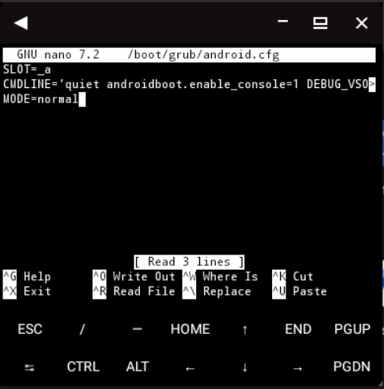
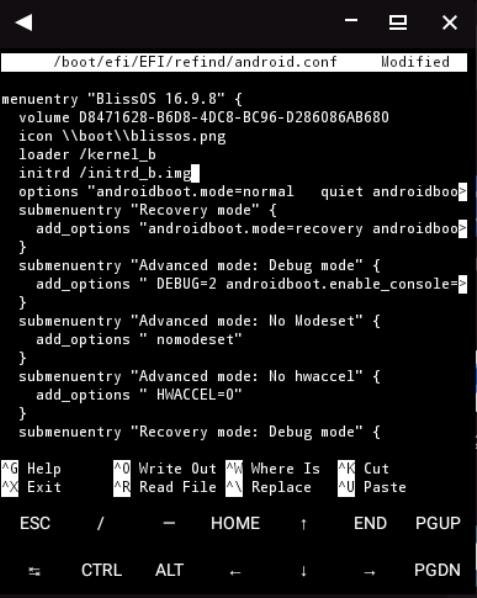
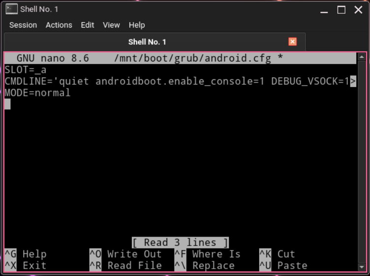
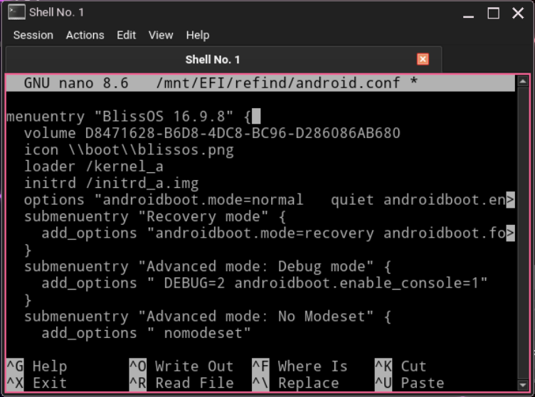

# Setup kernel's command-line parameters

Beside inheriting all the [command-line parameters](https://www.kernel.org/doc/html/latest/admin-guide/kernel-parameters.html) that are in the Linux kernel, BlissOS also utilize kernel parameters to set variables for some of our init scripts. This part will show you how to set it.

## Edit command-line parameters from BlissOS

You can edit the command-line parameters from inside BlissOS. You'll need a terminal emulator with root permissions (su) and a command-line based text editor to do this.
Since Termux, KernelSU and nano are available in BlissOS, we'll use them for these examples below.

> Note: See [Grant superuser permission or debug shell](grantsu.md) for how to grant `su` permission to apps from KernelSU.

### Using GRUB

If you installed BlissOS with GRUB, append your custom kernel parameter to end of the `CMDLINE` variable (inside quotes) in `/boot/grub/android.cfg` file.

For example, using `nano`:

```sh
/system/bin/blisspath
su -c 'nano /boot/grub/android.cfg'
```

{ width="500" }


### Using rEFInd

If you installed BlissOS with rEFInd, append your custom kernel parameter to end of `options` line (inside quotes) in `/boot/efi/EFI/refind/android.conf` file.

For example, using `nano`:

```sh
/system/bin/blisspath
su -c 'nano /boot/efi/EFI/refind/android.conf'
```

{ width="500" }

### Without bootloader

<!-- Needs mount root partition (to /data/local/tmp for example) and edit (rootfs)/cmdline.txt -->

!!!warning

    This is a little bit more complicated than any of above and can only be applied once you use [grub-android-prober](https://github.com/Ananda-Aropa/grub-android-prober). If you setup BlissOS for any other bootloaders, or setup BlissOS boot entry yourself, you should know how to do it on your own.

You'll need to mount the root partition to a temporary directory (for example `/data/local/tmp`) and edit the `cmdline.txt` file in the mount point. There are multiple ways to find root partition, here's one example using Termux:

```sh
# Export PATH
/system/bin/blisspath

# Install neccessary tools
pkg i tsu blk-utils
# blk-utils provides `findfs` which is needed but not available on BlissOS, so we need to install it from Termux's packages
# tsu provides `sudo` for simplifying the commands

# Findroot partition and evaluate it to a variable
# Parsed from `ROOT=` kernel parameter
eval export $(sudo grep -Eo "ROOT=[A-Za-z0-9=_-]+" /proc/cmdline)

# The root partition identifier is stored in variable `ROOT`
echo $ROOT
# You should get something like "UUID=..." or "LABEL=...", or even "/dev/sdXY" for example

# We need to locate its real device path
export ROOT=$(sudo findfs $ROOT)

# Now we have the real device path
echo $ROOT
# You should get something like "/dev/block/sdXY" or else. That is the root partition

# Mount the root partition to a temporary directory
# We will be using /data/local/tmp for example
sudo mount $ROOT /data/local/tmp

# Edit /data/local/tmp/cmdline.txt using nano
sudo nano /data/local/tmp/cmdline.txt
# Append your custom kernel parameter to end of the 1st line (must be the 1st line) and then save it.

# Unmount the root partition
sudo umount /data/local/tmp
```

## Edit command-line parameters from a Linux distro

You can edit the command-line parameters from any other Linux distribution.

!!!danger

    You're editing from a Linux distro, you cannot apply any of the above methods from [Edit command-line parameters from BlissOS](kernel-parameters.md#edit-command-line-parameters-from-blissos).

!!!warning

    Since you are using a Linux distro, we'd expect that you know how to mount partitions and edit files using this system. We'd also expect that you know where your BlissOS installation is.

!!!info

    You can also use these methods below to edit command-line parameters from [Bootable installer](../installation/auto/bootable-installer.md) environment (in case BlissOS is the only OS on your device or you just want to modify BlissOS kernel parameters right after installation).

### For BlissOS with GRUB

You must need to locate root partition of your BlissOS installation and mount it to a temporary directory (for example `/mnt`).

Append your custom kernel parameter to end of the `CMDLINE` variable (inside quotes) in `/boot/grub/android.cfg` file in BlissOS root partition (for example `/mnt/boot/grub/android.cfg`).

An example using `nano` on [Bootable installer](../installation/auto/bootable-installer.md):

```sh
# Replace /dev/sdXY with your BlissOS root partition
mount /dev/sdXY /mnt
nano /mnt/boot/grub/android.cfg
```

{ width="500" }

### For BlissOS with rEFInd

You must need to locate ESP (EFI system partition) and mount it (usually it's automatically mounted to `/boot/efi`). If you installed BlissOS to another disk, mount the disk's ESP to a temporary directory (for example `/mnt`).

Append your custom kernel parameter to end of `options` line (inside quotes) in `/EFI/refind/android.conf` file in BlissOS root partition.

An example using `nano` on [Bootable installer](../installation/auto/bootable-installer.md):

```sh
# Replace /dev/sdXY with your ESP partition of the disk where BlissOS is installed (usually it's the 1st partition of the disk)
mount /dev/sdXY /mnt
nano /mnt/EFI/refind/android.conf
```

{ width="500" }

### For BlissOS with no bootloader

!!!warning

    As mentioned in [Edit parameters from BlissOS without bootloader](#without-bootloader), this applies only if you are using [grub-android-prober](https://github.com/Ananda-Aropa/grub-android-prober).
    If you setup BlissOS for any other bootloaders, or setup BlissOS boot entry yourself, you should know how to modify BlissOS kernel parameters on your own.
    We are not responsible for any of your actions with your manual setup of BlissOS.

Mount BlissOS root partition to a temporary directory (for example `/mnt`).

Append your custom kernel parameter to end of the `cmdline.txt` file in BlissOS root partition.